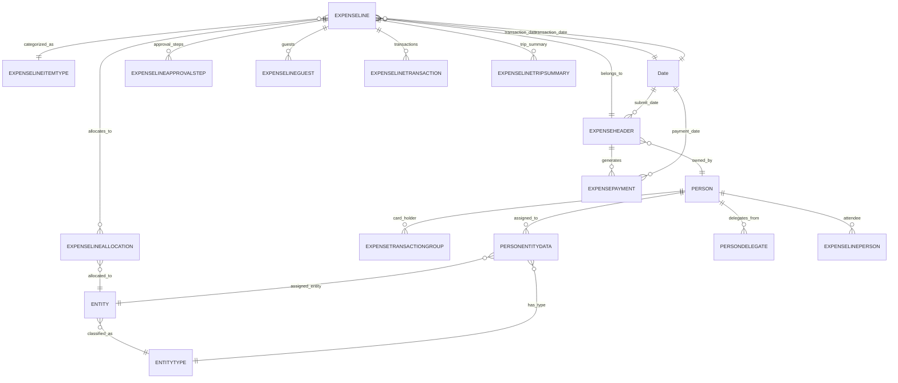

# Emburse Spend Model - Power BI Semantic Model Documentation

**Document Version:** 2.0  
**Last Updated:** December 19, 2025  
**Model Name:** Spend Model  
**Platform:** Power BI / Microsoft Fabric  
**Author:** Liberty Mutual Analytics Team

---

## Table of Contents

1. [Executive Summary](#executive-summary)
2. [Model Architecture Overview](#model-architecture-overview)
3. [Entity Relationship Diagram](#entity-relationship-diagram)
4. [Data Dictionary](#data-dictionary)
5. [Complete Measure Library](#complete-measure-library)
6. [Data Sources](#data-sources)
7. [Performance Optimizations](#performance-optimizations)
8. [Time Intelligence Patterns](#time-intelligence-patterns)
9. [Best Practices](#best-practices)
10. [Version History](#version-history)

---

## Executive Summary

The **Emburse Spend Model** is an enterprise-grade Power BI semantic model designed for comprehensive expense management analysis at Liberty Mutual. This model consolidates expense data from Emburse's Snowflake data warehouse, providing executives and analysts with real-time insights into employee expenses, credit card transactions, reimbursements, and cost allocations.

### Key Capabilities

- **Comprehensive Expense Analytics**: Track and analyze expense submissions, approvals, payments, and allocations across the organization
- **Time Intelligence**: 24 YTD/QTD/YoY measures enabling period-over-period comparisons and trend analysis
- **Organizational Drill-Through**: Navigate expense data by manager hierarchy, department, cost center, and employee
- **Quality Metrics**: Monitor return rates, compliance rates, and approval patterns
- **Real-Time Data**: Direct connection to Snowflake with query folding enabled for optimal performance

### Model Statistics

| Metric | Count |
|--------|-------|
| **Total Tables** | 26 |
| **Fact Tables** | 4 |
| **Dimension Tables** | 9 |
| **Support Tables** | 13 |
| **Relationships** | 18 |
| **Measures** | 106 |
| **Hierarchies** | 9 |
| **Date Range** | 2020-2030 |

### Recent Enhancements (v2.0)

1. ✅ Added 24 new time intelligence measures (YTD, QTD, YoY comparisons)
2. ✅ Enhanced employee and entity analysis measures
3. ✅ Implemented quality metrics (Return Rate, Compliance Rate)
4. ✅ Hidden all ID and technical columns for cleaner user experience
5. ✅ Added comprehensive column descriptions
6. ✅ Created organizational hierarchy for manager reporting
7. ✅ Verified and optimized query folding to Snowflake
8. ✅ Expanded model with 11 new tables for enhanced tracking

---

## Model Architecture Overview

The Spend Model follows a **star schema** design with clearly defined fact and dimension tables, optimized for analytical queries and interactive reporting.

### Architecture Layers

```
┌─────────────────────────────────────────────────────────────────┐
│                     PRESENTATION LAYER                          │
│  _Calculations Table: 106 Measures + Time Intelligence         │
└─────────────────────────────────────────────────────────────────┘
                              ▼
┌─────────────────────────────────────────────────────────────────┐
│                      FACT TABLES (4)                            │
│  - EXPENSELINE (Primary: 43 columns, 2 hierarchies)            │
│  - EXPENSELINEALLOCATION (16 columns)                          │
│  - EXPENSEPAYMENT (17 columns)                                 │
│  - EXPENSETRANSACTIONGROUP (24 columns)                        │
└─────────────────────────────────────────────────────────────────┘
                              ▼
┌─────────────────────────────────────────────────────────────────┐
│                   DIMENSION TABLES (9)                          │
│  - EXPENSEHEADER (15 columns, 1 hierarchy)                     │
│  - PERSON (24 columns, 2 hierarchies)                          │
│  - ENTITY (14 columns, 1 hierarchy)                            │
│  - ENTITYTYPE (8 columns)                                      │
│  - EXPENSELINEITEMTYPE (7 columns, 1 hierarchy)                │
│  - PERSONENTITYDATA (10 columns)                               │
│  - PERSONDELEGATE (7 columns)                                  │
│  - EXPENSELINEPERSON (7 columns)                               │
│  - DECODE (7 columns)                                          │
└─────────────────────────────────────────────────────────────────┘
                              ▼
┌─────────────────────────────────────────────────────────────────┐
│                  NEW TRACKING TABLES (11)                       │
│  - EXPENSELINEAPPROVALSTEP - Approval workflows                │
│  - EXPENSELINEALLOCATIONEXPORT - Export tracking               │
│  - EXPENSELINEALLOCATIONREFERENCE - Allocation segments        │
│  - EXPENSELINEAPPROVALSTEPMESSAGE - Approval messages          │
│  - EXPENSELINEGUEST - Guest/attendee details                   │
│  - EXPENSELINETRANSACTION - Transaction linkages               │
│  - EXPENSELINETRIPSUMMARY - Trip summaries                     │
│  - EXPENSETRANSACTIONGROUPLINK - Transaction linkages          │
│  - PERSONVACATIONDELEGATE - Vacation delegation                │
│  - ROLE - User roles                                           │
│  - UDAPIVOTMAP - UDA pivot mappings                            │
└─────────────────────────────────────────────────────────────────┘
                              ▼
┌─────────────────────────────────────────────────────────────────┐
│                    SUPPORT TABLES (2)                           │
│  - Date (20 columns, 2 hierarchies) - Calendar 2020-2030       │
│  - _Calculations (106 measures container)                      │
└─────────────────────────────────────────────────────────────────┘
                              ▼
┌─────────────────────────────────────────────────────────────────┐
│                       DATA SOURCE                               │
│         Snowflake Data Warehouse (Direct Query)                 │
└─────────────────────────────────────────────────────────────────┘
```

### Table Categories

#### 🎯 Fact Tables (Transaction Data)
1. **EXPENSELINE** - Primary fact table with individual expense items (43 columns, 2 hierarchies)
2. **EXPENSELINEALLOCATION** - Cost center allocations (16 columns)
3. **EXPENSEPAYMENT** - Employee reimbursements (17 columns)
4. **EXPENSETRANSACTIONGROUP** - Credit card statements (24 columns)

#### 📊 Dimension Tables (Master Data)
1. **EXPENSEHEADER** - Expense report headers (15 columns, 1 hierarchy)
2. **PERSON** - Employee directory with org hierarchy (24 columns, 2 hierarchies)
3. **ENTITY** - Cost centers and departments (14 columns, 1 hierarchy)
4. **ENTITYTYPE** - Entity classifications (8 columns)
5. **EXPENSELINEITEMTYPE** - Expense categories (7 columns, 1 hierarchy)
6. **PERSONENTITYDATA** - Employee-entity assignments (10 columns)
7. **PERSONDELEGATE** - Delegation relationships (7 columns)
8. **EXPENSELINEPERSON** - Attendee tracking (7 columns)
9. **DECODE** - System lookup codes (7 columns)

#### 🆕 New Tracking Tables (Enhanced in v2.0)
1. **EXPENSELINEAPPROVALSTEP** - Approval workflow steps and status
2. **EXPENSELINEALLOCATIONEXPORT** - Export tracking for allocations
3. **EXPENSELINEALLOCATIONREFERENCE** - Allocation segment references
4. **EXPENSELINEAPPROVALSTEPMESSAGE** - Approval messages and comments
5. **EXPENSELINEGUEST** - Guest and attendee details
6. **EXPENSELINETRANSACTION** - Transaction linkages
7. **EXPENSELINETRIPSUMMARY** - Trip summaries and travel details
8. **EXPENSETRANSACTIONGROUPLINK** - Transaction group linkages
9. **PERSONVACATIONDELEGATE** - Vacation delegation assignments
10. **ROLE** - User roles and permissions
11. **UDAPIVOTMAP** - User-defined attribute pivot mappings

#### 🛠️ Support Tables
1. **Date** - Calendar table covering 2020-2030 (20 columns, 2 hierarchies)
2. **_Calculations** - Measures container (106 calculated metrics)

---

## Entity Relationship Diagram

The following ERD illustrates the 18 active relationships in the Spend Model:



### Relationship Details

| # | From Table | To Table | Cardinality | Cross-Filter | Active |
|---|------------|----------|-------------|--------------|--------|
| 1 | EXPENSELINE | EXPENSEHEADER | Many-to-One | Single | ✅ |
| 2 | EXPENSELINE | EXPENSELINEITEMTYPE | Many-to-One | Single | ✅ |
| 3 | EXPENSELINE | Date (TransactionDate) | Many-to-One | Single | ✅ |
| 4 | EXPENSELINEALLOCATION | EXPENSELINE | Many-to-One | Single | ✅ |
| 5 | EXPENSELINEALLOCATION | ENTITY | Many-to-One | Single | ✅ |
| 6 | EXPENSEHEADER | PERSON | Many-to-One | Single | ✅ |
| 7 | EXPENSEHEADER | Date (SubmitDate) | Many-to-One | Single | ⚠️ Inactive |
| 8 | EXPENSEHEADER | Date (CreateDate) | Many-to-One | Single | ⚠️ Inactive |
| 9 | EXPENSEPAYMENT | EXPENSEHEADER | Many-to-One | Single | ✅ |
| 10 | EXPENSEPAYMENT | Date (PaymentDate) | Many-to-One | Single | ⚠️ Inactive |
| 11 | ENTITY | ENTITYTYPE | Many-to-One | Single | ✅ |
| 12 | EXPENSETRANSACTIONGROUP | PERSON | Many-to-One | Single | ✅ |
| 13 | EXPENSELINEPERSON | PERSON | Many-to-One | Single | ✅ |
| 14 | EXPENSELINEPERSON | EXPENSELINE | Many-to-One | Single | ⚠️ Inactive |
| 15 | PERSONENTITYDATA | PERSON | Many-to-One | Single | ✅ |
| 16 | PERSONENTITYDATA | ENTITY | Many-to-One | Single | ✅ |
| 17 | PERSONENTITYDATA | ENTITYTYPE | Many-to-One | Single | ⚠️ Inactive |
| 18 | PERSONDELEGATE | PERSON | Many-to-One | Single | ✅ |

**Note:** Inactive relationships are used via `USERELATIONSHIP()` in DAX measures for specific date context (payment dates, submit dates) or alternative analysis paths.

---

## Data Dictionary

### EXPENSEHEADER
**Description:** Master record for expense reports. Contains report-level metadata and totals.

| Column Name | Data Type | Description | Key | Sample Values |
|:---|:---|:---|:---|:---|
| EXPENSEREPORTHEADERID | String | Unique identifier for the expense report | PK | `EXP-001-2025` |
| REPORTID | String | External report identifier | | `RPT-12345` |
| REPORTNAME | String | User-friendly report name | | `Q4 Travel - December 2025` |
| OWNERPERSONID | Int64 | ID of employee who owns the report | FK | `1001, 1002` |
| CREATORPERSONID | Int64 | ID of report creator | FK | `1001, 1003` |
| SUBMITTERPERSONID | Int64 | ID of employee who submitted the report | FK | `1002, 1004` |
| CREATEDATE | DateTime | Date report was created | | `2025-01-15 09:30:00` |
| UPDATEDATE | DateTime | Date report was last updated | | `2025-01-16 14:22:00` |
| SUBMITDATE | DateTime | Date report was submitted for approval | | `2025-01-16 10:00:00` |
| PAYMEINCURRENCYCODE | String | Currency code for payment | | `USD, EUR` |
| STATUSSUBMIT | String | Report submission status | | `SUBMITTED, DRAFT` |
| HASHEADERRECEIPTS | Boolean | Flag: report has header-level receipts | | `TRUE, FALSE` |
| PAHEADERID | String | Payment header reference ID | | `PAH-5678` |
| _EMBURSE_UPDATEDATE | DateTime | System update timestamp | | `2025-12-18 21:33:03` |
| _EMBURSE_DELETED | Boolean | Soft delete flag | | `FALSE` |

---

### EXPENSELINE
**Description:** Individual expense items. Core fact table with transaction-level details.

**Hierarchies:**
- **Amount Detail:** Drill hierarchy from Currency Code → Amount Spent → Amount Customer Currency → Amount Approved for multi-currency and approval stage analysis
- **Expense Workflow:** Drill hierarchy from Transaction Date → Approval Status for expense lifecycle analysis

| Column Name | Data Type | Description | Key | Sample Values |
|:---|:---|:---|:---|:---|
| EXPENSEREPORTLINEID | String | Unique identifier for line item | PK | `LINE-001-001` |
| EXPENSEREPORTHEADERID | String | Reference to report header | FK | `EXP-001-2025` |
| EXPENSEITEMTYPEID | Int64 | Category type ID | FK | `1=Airfare, 2=Meals` |
| TRANSACTIONDATE | DateTime | Date expense was incurred | | `2025-01-10 00:00:00` |
| LINENUMBER | Int64 | Sequential line number | | `1, 2, 3` |
| CHILDLINENUMBER | Int64 | Child item sequence number | | `0, 1` |
| ISCOMPANYPAID | Boolean | Company paid expense flag | | `TRUE, FALSE` |
| ISPARENT | Boolean | Parent line item flag | | `TRUE, FALSE` |
| ISPERSONAL | Boolean | Personal expense flag | | `FALSE` |
| ISPERDIEM | Boolean | Per diem flag | | `FALSE, TRUE` |
| ISCHILDITEM | Boolean | Child item flag | | `FALSE` |
| DESCRIPTION | String | Employee-entered description | | `Flight to NYC - Business meeting` |
| BUSINESSPURPOSE | String | Business justification | | `Q4 Strategic Planning Meeting` |
| STATUSAPPROVED | String | Approval status | | `APP, PEND, DRAF, RET` |
| STATUSAUDIT | String | Audit status | | `PASS, FAIL` |
| STATUSDIRECTPAY | String | Direct pay status | | `YES, NO` |
| STATUSEXPORT | String | Export status | | `EXPORTED, PENDING` |
| CURRENCYCODESPENT | String | Currency of original spend | | `USD, EUR, GBP` |
| AMOUNTSPENT | Double | Amount in original currency | | `750.50, 125.00` |
| CURRENCYCODECUSTOMER | String | Customer/company currency | | `USD` |
| AMOUNTCUSTOMER | Double | Amount in company currency | | `750.50` |
| AMOUNTAPPROVED | Double | Approved amount (may be partial) | | `750.50` |
| AMOUNTNONREIMBURSEABLESPENT | Double | Non-reimbursable amount | | `0.00` |
| TAXLOCATIONCODE | String | Tax location code | | `CA, NY, TX` |
| EXCHANGERATECUSTOMER | Double | Currency exchange rate | | `1.0, 0.92` |
| EXCHANGERATEENTERED | Double | Manually entered exchange rate | | `1.0` |
| HASLINERECEIPTS | Boolean | Receipt attached flag | | `TRUE, FALSE` |
| AMOUNTSPENTCONVERTED | Double | Amount after currency conversion | | `750.50` |
| AMOUNTNONREIMBURSEABLESPENTCONVERTED | Double | Non-reimbursable converted amount | | `0.00` |
| AMOUNTPAYME | Double | PayMe system amount | | `750.50` |
| CURRENCYCODESPENTCONVERTED | String | Converted currency code | | `USD` |
| EXPORTDATE | DateTime | Date exported | | `2025-01-17 08:00:00` |
| EXPORTDATEDIRECTPAY | DateTime | Direct pay export date | | `2025-01-17 08:00:00` |
| NOTE | String | Additional notes | | `Conference registration` |
| PARENTEXPENSEREPORTLINEID | String | Parent line reference | | `LINE-001-000` |
| EXCHANGERATEPAYMENT | Double | Payment exchange rate | | `1.0` |
| EXPENSELINETRANSACTIONID | Int64 | Transaction ID | | `5001, 5002` |
| _EMBURSE_UPDATEDATE | DateTime | System update timestamp | | `2025-12-18 21:33:03` |
| _EMBURSE_DELETED | Boolean | Soft delete flag | | `FALSE` |

---

### EXPENSELINEALLOCATION
**Description:** Cost center allocations. Splits expenses across entities and departments.

| Column Name | Data Type | Description | Key | Sample Values |
|:---|:---|:---|:---|:---|
| EXPENSELINEALLOCATIONID | Int64 | Unique allocation ID | PK | `1001, 1002` |
| EXPENSEREPORTLINEID | String | Reference to line item | FK | `LINE-001-001` |
| ALLOCATIONID | Int64 | Allocation reference | | `5001, 5002` |
| PERCENT | Double | Allocation percentage | | `100.0, 50.0` |
| AMOUNTSPENTCONVERTED | Double | Allocated amount (converted) | | `375.25` |
| AMOUNTAPPROVED | Double | Approved allocation amount | | `375.25` |
| AMOUNTCUSTOMER | Double | Allocation in company currency | | `375.25` |
| AMOUNTPAYME | Double | PayMe allocation amount | | `375.25` |
| ENTITY1ID | Int64 | Primary cost center ID | FK | `100, 101` |
| ENTITY2ID | Int64 | Secondary cost center ID | FK | `200, 201` |
| COSTCODE | String | Cost code reference | | `CC-1001, CC-2002` |
| ALLOCATIONREFERENCE | String | Reference number | | `ALLOC-001` |
| CREATEDATE | DateTime | Allocation created date | | `2025-01-10 10:00:00` |
| UPDATEDATE | DateTime | Allocation updated date | | `2025-01-11 14:30:00` |
| _EMBURSE_UPDATEDATE | DateTime | System update timestamp | | `2025-12-18 21:33:03` |
| _EMBURSE_DELETED | Boolean | Soft delete flag | | `FALSE` |

---

### EXPENSEPAYMENT
**Description:** Reimbursement records. Tracks payments made to employees.

| Column Name | Data Type | Description | Key | Sample Values |
|:---|:---|:---|:---|:---|
| EXPENSEPAYMENTID | Int64 | Unique payment ID | PK | `2001, 2002` |
| EXPENSEREPORTHEADERID | String | Reference to report | FK | `EXP-001-2025` |
| PAYMENTDATE | DateTime | Date of reimbursement | | `2025-01-20 00:00:00` |
| AMOUNT | Double | Reimbursement amount | | `1500.75` |
| CREATEDATE | DateTime | Payment record created date | | `2025-01-18 09:00:00` |
| STATUS | String | Payment status | | `PAID, PENDING` |
| PAYMENTTYPE | String | Payment method | | `ACH, CHECK, WIRE` |
| LINENUMBER | String | Associated line reference | | `001` |
| BANKNUMBER | String | Bank account number (masked) | | `****1234` |
| VOUCHERINVOICE | String | Voucher/invoice number | | `VOC-5001` |
| BATCHPID | String | Batch process ID | | `BATCH-001` |
| BATCHPIDQUEUED | String | Queued batch ID | | `BATCH-001` |
| CURRENCYCODE | String | Payment currency | | `USD` |
| CUSTOMERFEEDID | Int64 | Customer feed reference | | `1001` |
| CHECKNUMBER | String | Check number (if applicable) | | `CHK-12345` |
| _EMBURSE_UPDATEDATE | DateTime | System update timestamp | | `2025-12-18 21:33:03` |
| _EMBURSE_DELETED | Boolean | Soft delete flag | | `FALSE` |

---

### PERSON
**Description:** Employee directory. Master employee reference data.

**Hierarchies:**
- **Employee Name:** Drill hierarchy from Customer Unique ID → Last Name → First Name → Full Name for personnel-based expense analysis

| Column Name | Data Type | Description | Key | Sample Values |
|:---|:---|:---|:---|:---|
| PERSONID | Int64 | Unique employee ID | PK | `1001, 1002` |
| FIRSTNAME | String | First name | | `John, Sarah` |
| LASTNAME | String | Last name | | `Smith, Johnson` |
| FULLNAME | String | Full name (formatted) | | `Smith, John` |
| TITLE | String | Job title | | `Manager, Analyst` |
| STATUS | String | Employment status | | `ACTIVE, INACTIVE` |
| CUSTOMERUNIQUEID | String | Customer system ID | | `CUST-001` |
| EMAILADDRESS | String | Email address | | `john.smith@company.com` |
| USERNAME | String | System username | | `jsmith` |
| REPORTSTOPERSONID | Int64 | Manager ID (reports to) | FK | `1000` |
| ISADMINUSER | Boolean | Administrator flag | | `TRUE, FALSE` |
| ISSUPERDELEGATEUSER | Boolean | Super delegate flag | | `FALSE` |
| ISANALYTICSUSER | Boolean | Analytics access flag | | `TRUE, FALSE` |
| TAXLOCATIONCODE | String | Tax location | | `CA, NY` |
| PREFERREDCURRENCY | String | Preferred currency | | `USD, EUR` |
| PREFERREDVENDORCODE | String | Preferred vendor code | | `VENDOR-001` |
| ALTERNATEVENDORCODE | String | Alternate vendor code | | `VENDOR-002` |
| UDF1, UDF2, UDF3 | String | User-defined fields | | Custom data |
| CREATEDATE | DateTime | Record created date | | `2024-01-01 00:00:00` |
| UPDATEDATE | DateTime | Record updated date | | `2025-12-15 10:00:00` |
| _EMBURSE_UPDATEDATE | DateTime | System update timestamp | | `2025-12-18 21:33:03` |
| _EMBURSE_DELETED | Boolean | Soft delete flag | | `FALSE` |

---

### ENTITY
**Description:** Cost centers and organizational units.

| Column Name | Data Type | Description | Key | Sample Values |
|:---|:---|:---|:---|:---|
| ENTITYID | Int64 | Unique entity ID | PK | `100, 101` |
| ENTITYTYPEID | Int64 | Entity type reference | FK | `1=Department` |
| ENTITYCODE | String | Entity code | | `DEPT-001, CC-2022` |
| ENTITYNAME | String | Entity name | | `Sales, Engineering` |
| ENTITYISACTIVE | Boolean | Active flag | | `TRUE, FALSE` |
| EXTRADATA1-5 | String | Additional fields | | Custom data |
| CREATEDATE | DateTime | Created date | | `2024-01-01 00:00:00` |
| UPDATEDATE | DateTime | Updated date | | `2025-12-15 10:00:00` |
| _EMBURSE_UPDATEDATE | DateTime | System update timestamp | | `2025-12-18 21:33:03` |
| _EMBURSE_DELETED | Boolean | Soft delete flag | | `FALSE` |

---

### Date (Calendar Table)
**Description:** Time dimension table for time intelligence calculations.

| Column Name | Data Type | Description | Key | Sample Values |
|:---|:---|:---|:---|:---|
| Date | DateTime | Calendar date | PK | `2025-01-01` |
| Year | Int64 | Calendar year | | `2025, 2024` |
| Year-Month | String | Year-Month format | | `2025-01, 2024-12` |
| Month Number | Int64 | Month (1-12) | | `1, 12` |
| Month Name | String | Full month name | | `January, December` |
| Month Short | String | Short month name | | `Jan, Dec` |
| Quarter | String | Quarter (Q1-Q4) | | `Q1, Q4` |
| Quarter Number | Int64 | Quarter number | | `1, 4` |
| Day of Week | Int64 | Day of week (1-7) | | `1=Sunday, 7=Saturday` |
| Day Name | String | Full day name | | `Monday, Friday` |
| Day Short | String | Short day name | | `Mon, Fri` |
| Day of Month | Int64 | Day (1-31) | | `1, 31` |
| Day of Year | Int64 | Day of year (1-365) | | `1, 365` |
| Week of Year | Int64 | ISO week number | | `1, 52` |
| Is Weekend | Boolean | Weekend flag | | `TRUE, FALSE` |
| Fiscal Year | Int64 | Fiscal year (starts July) | | `2025, 2024` |
| Fiscal Quarter | String | Fiscal quarter | | `FQ1, FQ4` |
| Is Current Month | Boolean | Current month flag | | `TRUE, FALSE` |
| Is Current Quarter | Boolean | Current quarter flag | | `TRUE, FALSE` |
| Is Current Year | Boolean | Current year flag | | `TRUE, FALSE` |

---

## Measures & KPIs

The semantic model includes **82 measures** organized into logical business domains. Each measure is documented with its DAX expression, business logic, and intended use case.

### Key Metrics - Base Amounts

#### Amount Approved
**Business Name:** Approved Expenses  
**Description:** Total amount spent by employees with 'Approved' status. Represents expenses ready for reimbursement.

```dax
= CALCULATE(SUM(EXPENSELINE[AMOUNTSPENT]), EXPENSELINE[STATUSAPPROVED] = "APP")
```

**Use Case:** Primary KPI for approved spending analysis  
**Format:** Currency ($#,0.00)

---

#### Amount Returned
**Business Name:** Returned/Rejected Expenses  
**Description:** Total amount spent by employees with 'Returned' status. Tracks expenses rejected or sent back for revision.

```dax
= CALCULATE(SUM(EXPENSELINE[AMOUNTSPENT]), EXPENSELINE[STATUSAPPROVED] = "RET")
```

**Use Case:** Identify potential policy violations and return trends  
**Format:** Currency ($#,0.00)

---

#### Net Amount
**Business Name:** Net Approved Expenses  
**Description:** Net difference between approved and returned amounts. Shows actual net expense impact.

```dax
= [Amount Approved] - [Amount Returned]
```

**Use Case:** True expense liability tracking  
**Format:** Currency ($#,0.00)

---

### Time Intelligence Measures - Monthly Analysis

#### Amount Approved MTD
**Business Name:** Approved Expenses (Month-to-Date)  
**Description:** Month-to-date total of approved expenses from start of current month to today.

```dax
= CALCULATE([Amount Approved], DATESMTD('Date'[Date]))
```

**Use Case:** Track monthly approval progress  
**Format:** Currency ($#,0.00)

---

#### Amount Approved MoM Change
**Business Name:** Month-over-Month Change (Approved)  
**Description:** Dollar change in approved amounts from previous month to current month.

```dax
= [Amount Approved] - [Amount Approved Previous Month]
```

**Use Case:** Trend analysis and variance reporting  
**Format:** Currency ($#,0.00)

---

#### Amount Approved MoM % Change
**Business Name:** Month-over-Month % Change (Approved)  
**Description:** Percentage change in approved amounts from previous month.

```dax
= DIVIDE([Amount Approved MoM Change], [Amount Approved Previous Month], 0)
```

**Use Case:** Normalized trend comparison  
**Format:** Percentage (0.00%)

---

### Line Items - Counts & Status

#### Total Line Items
**Business Name:** Total Expense Items  
**Description:** Total count of individual expense line items across all reports.

```dax
= COUNTROWS(EXPENSELINE)
```

**Use Case:** Activity volume metrics  
**Format:** Number (#,0)

---

#### Lines Approved
**Business Name:** Approved Line Items  
**Description:** Count of expense lines with approval status = 'APP'.

```dax
= CALCULATE(COUNTROWS(EXPENSELINE), EXPENSELINE[STATUSAPPROVED] = "APP")
```

**Use Case:** Approval process monitoring  
**Format:** Number (#,0)

---

#### Lines Pending
**Business Name:** Pending Line Items  
**Description:** Count of expense lines awaiting approval (status = 'PEND').

```dax
= CALCULATE(COUNTROWS(EXPENSELINE), EXPENSELINE[STATUSAPPROVED] = "PEND")
```

**Use Case:** Workflow bottleneck identification  
**Format:** Number (#,0)

---

#### Receipt Compliance Rate
**Business Name:** Receipt Submission Compliance %  
**Description:** Percentage of expense items with attached receipt documentation.

```dax
= DIVIDE([Lines With Receipts], [Total Line Items], 0)
```

**Use Case:** Compliance monitoring  
**Format:** Percentage (0.0%)

---

### Reports - Timing Metrics

#### Average Days to Submit
**Business Name:** Average Days to Report Submission  
**Description:** Average number of days between report creation and submission.

```dax
= AVERAGEX(FILTER(EXPENSEHEADER, NOT(ISBLANK(EXPENSEHEADER[SUBMITDATE])) && NOT(ISBLANK(EXPENSEHEADER[CREATEDATE]))), DATEDIFF(EXPENSEHEADER[CREATEDATE], EXPENSEHEADER[SUBMITDATE], DAY))
```

**Use Case:** Process efficiency tracking  
**Format:** Number (#,0)

---

#### Average Days to Payment
**Business Name:** Average Days to Employee Reimbursement  
**Description:** Average number of days between payment record creation and actual payment date.

```dax
= AVERAGEX(FILTER(EXPENSEPAYMENT, NOT(ISBLANK(EXPENSEPAYMENT[PAYMENTDATE])) && NOT(ISBLANK(EXPENSEPAYMENT[CREATEDATE]))), DATEDIFF(EXPENSEPAYMENT[CREATEDATE], EXPENSEPAYMENT[PAYMENTDATE], DAY))
```

**Use Case:** Payment processing KPI  
**Format:** Number (#,0)

---

### Payments - Summary Metrics

#### Total Payment Amount
**Business Name:** Total Reimbursements  
**Description:** Sum of all reimbursement amounts paid to employees.

```dax
= SUM(EXPENSEPAYMENT[AMOUNT])
```

**Use Case:** Cash flow analysis  
**Format:** Currency ($#,0.00)

---

#### Payment Amount MTD
**Business Name:** Reimbursement Amount (Month-to-Date)  
**Description:** Month-to-date payment total using payment date (not transaction date).

```dax
= CALCULATE([Total Payment Amount], USERELATIONSHIP(EXPENSEPAYMENT[PAYMENTDATE], 'Date'[Date]), DATESMTD('Date'[Date]))
```

**Use Case:** Monthly payment tracking  
**Format:** Currency ($#,0.00)

---

### Allocations - Cost Distribution

#### Total Allocations
**Business Name:** Total Cost Allocations  
**Description:** Count of allocation records. Allocations split expenses across cost centers.

```dax
= COUNTROWS(EXPENSELINEALLOCATION)
```

**Use Case:** Cost allocation activity  
**Format:** Number (#,0)

---

#### Total Allocated Amount Spent
**Business Name:** Total Allocated Expense Amount  
**Description:** Sum of allocated amounts after currency conversion.

```dax
= SUM(EXPENSELINEALLOCATION[AMOUNTSPENTCONVERTED])
```

**Use Case:** Cost center expense tracking  
**Format:** Currency ($#,0.00)

---

#### Average Allocation Percentage
**Business Name:** Average Allocation Split %  
**Description:** Average allocation percentage across all allocations.

```dax
= AVERAGE(EXPENSELINEALLOCATION[PERCENT])
```

**Use Case:** Allocation pattern analysis  
**Format:** Percentage (0.0%)

---

### Transaction Groups - Credit Card Statements

#### Total Current Balance
**Business Name:** Total Credit Card Current Balance  
**Description:** Sum of current balances across all credit card statements.

```dax
= SUM(EXPENSETRANSACTIONGROUP[STATEMENTCURRENTBALANCE])
```

**Use Case:** Credit card liability tracking  
**Format:** Currency ($#,0.00)

---

#### Total New Charges
**Business Name:** New Credit Card Charges  
**Description:** Sum of new charges added in current statement cycle.

```dax
= SUM(EXPENSETRANSACTIONGROUP[NEWCHARGES])
```

**Use Case:** Statement activity monitoring  
**Format:** Currency ($#,0.00)

---

## Complete Measure Library

The Spend Model includes **106 measures** organized into logical display folders. This includes 82 original measures plus 24 newly added time intelligence measures (YTD, QTD, YoY comparisons).

### 📊 Measure Organization

| Display Folder | Measure Count | Purpose |
|----------------|---------------|---------|
| **Base Metrics** | 15 | Core spending amounts and counts |
| **Time Intelligence - YTD** | 8 | Year-to-date calculations |
| **Time Intelligence - QTD** | 8 | Quarter-to-date calculations |
| **Time Intelligence - YoY** | 8 | Year-over-year comparisons |
| **Monthly Analysis** | 12 | Month-over-month trends |
| **Line Items** | 18 | Transaction-level metrics |
| **Reports** | 12 | Report-level analytics |
| **Payments** | 10 | Reimbursement metrics |
| **Allocations** | 8 | Cost center allocations |
| **Quality Metrics** | 7 | Compliance and quality indicators |

---

### 📈 Base Metrics

#### Amount Approved
**Display Folder:** Base Metrics  
**Description:** Total approved expenses (Status = 'APP')

```dax
Amount Approved = 
CALCULATE(
    SUM(EXPENSELINE[AMOUNTSPENT]), 
    EXPENSELINE[STATUSAPPROVED] = "APP"
)
```

---

#### Amount Returned
**Display Folder:** Base Metrics  
**Description:** Total returned/rejected expenses (Status = 'RET')

```dax
Amount Returned = 
CALCULATE(
    SUM(EXPENSELINE[AMOUNTSPENT]), 
    EXPENSELINE[STATUSAPPROVED] = "RET"
)
```

---

#### Net Amount
**Display Folder:** Base Metrics  
**Description:** Net approved expenses (Approved - Returned)

```dax
Net Amount = [Amount Approved] - [Amount Returned]
```

---

#### Total Line Items
**Display Folder:** Base Metrics  
**Description:** Total count of expense line items

```dax
Total Line Items = COUNTROWS(EXPENSELINE)
```

---

#### Total Reports
**Display Folder:** Base Metrics  
**Description:** Total count of expense reports

```dax
Total Reports = COUNTROWS(EXPENSEHEADER)
```

---

#### Total Employees
**Display Folder:** Base Metrics  
**Description:** Distinct count of employees with expenses

```dax
Total Employees = DISTINCTCOUNT(EXPENSEHEADER[OWNERPERSONID])
```

---

#### Total Entities
**Display Folder:** Base Metrics  
**Description:** Distinct count of cost centers used

```dax
Total Entities = DISTINCTCOUNT(EXPENSELINEALLOCATION[ENTITY1ID])
```

---

#### Average Expense Amount
**Display Folder:** Base Metrics  
**Description:** Average amount per expense line

```dax
Average Expense Amount = AVERAGE(EXPENSELINE[AMOUNTSPENT])
```

---

#### Median Expense Amount
**Display Folder:** Base Metrics  
**Description:** Median amount per expense line

```dax
Median Expense Amount = MEDIAN(EXPENSELINE[AMOUNTSPENT])
```

---

#### Total Amount Spent
**Display Folder:** Base Metrics  
**Description:** Total amount spent across all line items

```dax
Total Amount Spent = SUM(EXPENSELINE[AMOUNTSPENT])
```

---

#### Total Amount Customer Currency
**Display Folder:** Base Metrics  
**Description:** Total amount in company currency

```dax
Total Amount Customer Currency = SUM(EXPENSELINE[AMOUNTCUSTOMER])
```

---

#### Total Non-Reimbursable Amount
**Display Folder:** Base Metrics  
**Description:** Total non-reimbursable expenses

```dax
Total Non-Reimbursable Amount = SUM(EXPENSELINE[AMOUNTNONREIMBURSEABLESPENT])
```

---

#### Total Reimbursable Amount
**Display Folder:** Base Metrics  
**Description:** Total reimbursable expenses (Spent - Non-Reimbursable)

```dax
Total Reimbursable Amount = 
[Total Amount Spent] - [Total Non-Reimbursable Amount]
```

---

#### Average Report Amount
**Display Folder:** Base Metrics  
**Description:** Average total per expense report

```dax
Average Report Amount = 
DIVIDE(
    [Amount Approved],
    [Total Reports],
    0
)
```

---

#### Average Lines Per Report
**Display Folder:** Base Metrics  
**Description:** Average number of line items per report

```dax
Average Lines Per Report = 
DIVIDE(
    [Total Line Items],
    [Total Reports],
    0
)
```

---

### 📅 Time Intelligence - YTD (Year-to-Date)

#### Amount Approved YTD
**Display Folder:** Time Intelligence - YTD  
**Description:** Year-to-date approved expenses

```dax
Amount Approved YTD = 
CALCULATE(
    [Amount Approved],
    DATESYTD('Date'[Date])
)
```

---

#### Amount Returned YTD
**Display Folder:** Time Intelligence - YTD  
**Description:** Year-to-date returned expenses

```dax
Amount Returned YTD = 
CALCULATE(
    [Amount Returned],
    DATESYTD('Date'[Date])
)
```

---

#### Net Amount YTD
**Display Folder:** Time Intelligence - YTD  
**Description:** Year-to-date net expenses

```dax
Net Amount YTD = 
CALCULATE(
    [Net Amount],
    DATESYTD('Date'[Date])
)
```

---

#### Amount Approved Previous Year YTD
**Display Folder:** Time Intelligence - YTD  
**Description:** Prior year YTD approved expenses for comparison

```dax
Amount Approved Previous Year YTD = 
CALCULATE(
    [Amount Approved YTD],
    SAMEPERIODLASTYEAR('Date'[Date])
)
```

---

#### Amount Returned Previous Year YTD
**Display Folder:** Time Intelligence - YTD  
**Description:** Prior year YTD returned expenses

```dax
Amount Returned Previous Year YTD = 
CALCULATE(
    [Amount Returned YTD],
    SAMEPERIODLASTYEAR('Date'[Date])
)
```

---

#### Net Amount Previous Year YTD
**Display Folder:** Time Intelligence - YTD  
**Description:** Prior year YTD net expenses

```dax
Net Amount Previous Year YTD = 
CALCULATE(
    [Net Amount YTD],
    SAMEPERIODLASTYEAR('Date'[Date])
)
```

---

#### Amount Approved YoY YTD Change
**Display Folder:** Time Intelligence - YTD  
**Description:** YoY change in YTD approved expenses

```dax
Amount Approved YoY YTD Change = 
[Amount Approved YTD] - [Amount Approved Previous Year YTD]
```

---

#### Amount Approved YoY YTD % Change
**Display Folder:** Time Intelligence - YTD  
**Description:** YoY percentage change in YTD approved expenses

```dax
Amount Approved YoY YTD % Change = 
DIVIDE(
    [Amount Approved YoY YTD Change],
    [Amount Approved Previous Year YTD],
    0
)
```

---

### 📅 Time Intelligence - QTD (Quarter-to-Date)

#### Amount Approved QTD
**Display Folder:** Time Intelligence - QTD  
**Description:** Quarter-to-date approved expenses

```dax
Amount Approved QTD = 
CALCULATE(
    [Amount Approved],
    DATESQTD('Date'[Date])
)
```

---

#### Amount Returned QTD
**Display Folder:** Time Intelligence - QTD  
**Description:** Quarter-to-date returned expenses

```dax
Amount Returned QTD = 
CALCULATE(
    [Amount Returned],
    DATESQTD('Date'[Date])
)
```

---

#### Net Amount QTD
**Display Folder:** Time Intelligence - QTD  
**Description:** Quarter-to-date net expenses

```dax
Net Amount QTD = 
CALCULATE(
    [Net Amount],
    DATESQTD('Date'[Date])
)
```

---

#### Amount Approved Previous Quarter QTD
**Display Folder:** Time Intelligence - QTD  
**Description:** Prior quarter QTD approved expenses

```dax
Amount Approved Previous Quarter QTD = 
CALCULATE(
    [Amount Approved QTD],
    PARALLELPERIOD('Date'[Date], -1, QUARTER)
)
```

---

#### Amount Returned Previous Quarter QTD
**Display Folder:** Time Intelligence - QTD  
**Description:** Prior quarter QTD returned expenses

```dax
Amount Returned Previous Quarter QTD = 
CALCULATE(
    [Amount Returned QTD],
    PARALLELPERIOD('Date'[Date], -1, QUARTER)
)
```

---

#### Net Amount Previous Quarter QTD
**Display Folder:** Time Intelligence - QTD  
**Description:** Prior quarter QTD net expenses

```dax
Net Amount Previous Quarter QTD = 
CALCULATE(
    [Net Amount QTD],
    PARALLELPERIOD('Date'[Date], -1, QUARTER)
)
```

---

#### Amount Approved QoQ QTD Change
**Display Folder:** Time Intelligence - QTD  
**Description:** Quarter-over-quarter change in QTD approved expenses

```dax
Amount Approved QoQ QTD Change = 
[Amount Approved QTD] - [Amount Approved Previous Quarter QTD]
```

---

#### Amount Approved QoQ QTD % Change
**Display Folder:** Time Intelligence - QTD  
**Description:** Quarter-over-quarter percentage change in QTD approved expenses

```dax
Amount Approved QoQ QTD % Change = 
DIVIDE(
    [Amount Approved QoQ QTD Change],
    [Amount Approved Previous Quarter QTD],
    0
)
```

---

### 📅 Time Intelligence - YoY (Year-over-Year)

#### Amount Approved Same Period Last Year
**Display Folder:** Time Intelligence - YoY  
**Description:** Approved expenses same period last year

```dax
Amount Approved Same Period Last Year = 
CALCULATE(
    [Amount Approved],
    SAMEPERIODLASTYEAR('Date'[Date])
)
```

---

#### Amount Returned Same Period Last Year
**Display Folder:** Time Intelligence - YoY  
**Description:** Returned expenses same period last year

```dax
Amount Returned Same Period Last Year = 
CALCULATE(
    [Amount Returned],
    SAMEPERIODLASTYEAR('Date'[Date])
)
```

---

#### Net Amount Same Period Last Year
**Display Folder:** Time Intelligence - YoY  
**Description:** Net expenses same period last year

```dax
Net Amount Same Period Last Year = 
CALCULATE(
    [Net Amount],
    SAMEPERIODLASTYEAR('Date'[Date])
)
```

---

#### Amount Approved YoY Change
**Display Folder:** Time Intelligence - YoY  
**Description:** Year-over-year change in approved expenses

```dax
Amount Approved YoY Change = 
[Amount Approved] - [Amount Approved Same Period Last Year]
```

---

#### Amount Approved YoY % Change
**Display Folder:** Time Intelligence - YoY  
**Description:** Year-over-year percentage change in approved expenses

```dax
Amount Approved YoY % Change = 
DIVIDE(
    [Amount Approved YoY Change],
    [Amount Approved Same Period Last Year],
    0
)
```

---

#### Amount Returned YoY Change
**Display Folder:** Time Intelligence - YoY  
**Description:** Year-over-year change in returned expenses

```dax
Amount Returned YoY Change = 
[Amount Returned] - [Amount Returned Same Period Last Year]
```

---

#### Amount Returned YoY % Change
**Display Folder:** Time Intelligence - YoY  
**Description:** Year-over-year percentage change in returned expenses

```dax
Amount Returned YoY % Change = 
DIVIDE(
    [Amount Returned YoY Change],
    [Amount Returned Same Period Last Year],
    0
)
```

---

#### Net Amount YoY % Change
**Display Folder:** Time Intelligence - YoY  
**Description:** Year-over-year percentage change in net expenses

```dax
Net Amount YoY % Change = 
DIVIDE(
    [Net Amount] - [Net Amount Same Period Last Year],
    [Net Amount Same Period Last Year],
    0
)
```

---

### 📊 Monthly Analysis

#### Amount Approved MTD
**Display Folder:** Monthly Analysis  
**Description:** Month-to-date approved expenses

```dax
Amount Approved MTD = 
CALCULATE(
    [Amount Approved],
    DATESMTD('Date'[Date])
)
```

---

#### Amount Approved Previous Month
**Display Folder:** Monthly Analysis  
**Description:** Prior month approved expenses

```dax
Amount Approved Previous Month = 
CALCULATE(
    [Amount Approved],
    DATEADD('Date'[Date], -1, MONTH)
)
```

---

#### Amount Approved MoM Change
**Display Folder:** Monthly Analysis  
**Description:** Month-over-month change in approved expenses

```dax
Amount Approved MoM Change = 
[Amount Approved] - [Amount Approved Previous Month]
```

---

#### Amount Approved MoM % Change
**Display Folder:** Monthly Analysis  
**Description:** Month-over-month percentage change

```dax
Amount Approved MoM % Change = 
DIVIDE(
    [Amount Approved MoM Change],
    [Amount Approved Previous Month],
    0
)
```

---

#### Amount Returned MTD
**Display Folder:** Monthly Analysis  
**Description:** Month-to-date returned expenses

```dax
Amount Returned MTD = 
CALCULATE(
    [Amount Returned],
    DATESMTD('Date'[Date])
)
```

---

#### Amount Returned Previous Month
**Display Folder:** Monthly Analysis  
**Description:** Prior month returned expenses

```dax
Amount Returned Previous Month = 
CALCULATE(
    [Amount Returned],
    DATEADD('Date'[Date], -1, MONTH)
)
```

---

#### Amount Returned MoM Change
**Display Folder:** Monthly Analysis  
**Description:** Month-over-month change in returned expenses

```dax
Amount Returned MoM Change = 
[Amount Returned] - [Amount Returned Previous Month]
```

---

#### Amount Returned MoM % Change
**Display Folder:** Monthly Analysis  
**Description:** Month-over-month percentage change

```dax
Amount Returned MoM % Change = 
DIVIDE(
    [Amount Returned MoM Change],
    [Amount Returned Previous Month],
    0
)
```

---

#### Net Amount MTD
**Display Folder:** Monthly Analysis  
**Description:** Month-to-date net expenses

```dax
Net Amount MTD = 
CALCULATE(
    [Net Amount],
    DATESMTD('Date'[Date])
)
```

---

#### Net Amount Previous Month
**Display Folder:** Monthly Analysis  
**Description:** Prior month net expenses

```dax
Net Amount Previous Month = 
CALCULATE(
    [Net Amount],
    DATEADD('Date'[Date], -1, MONTH)
)
```

---

#### Net Amount MoM Change
**Display Folder:** Monthly Analysis  
**Description:** Month-over-month change in net expenses

```dax
Net Amount MoM Change = 
[Net Amount] - [Net Amount Previous Month]
```

---

#### Net Amount MoM % Change
**Display Folder:** Monthly Analysis  
**Description:** Month-over-month percentage change

```dax
Net Amount MoM % Change = 
DIVIDE(
    [Net Amount MoM Change],
    [Net Amount Previous Month],
    0
)
```

---

### 📝 Line Items

#### Lines Approved
**Display Folder:** Line Items  
**Description:** Count of approved line items

```dax
Lines Approved = 
CALCULATE(
    COUNTROWS(EXPENSELINE),
    EXPENSELINE[STATUSAPPROVED] = "APP"
)
```

---

#### Lines Pending
**Display Folder:** Line Items  
**Description:** Count of pending line items

```dax
Lines Pending = 
CALCULATE(
    COUNTROWS(EXPENSELINE),
    EXPENSELINE[STATUSAPPROVED] = "PEND"
)
```

---

#### Lines Returned
**Display Folder:** Line Items  
**Description:** Count of returned line items

```dax
Lines Returned = 
CALCULATE(
    COUNTROWS(EXPENSELINE),
    EXPENSELINE[STATUSAPPROVED] = "RET"
)
```

---

#### Lines Draft
**Display Folder:** Line Items  
**Description:** Count of draft line items

```dax
Lines Draft = 
CALCULATE(
    COUNTROWS(EXPENSELINE),
    EXPENSELINE[STATUSAPPROVED] = "DRAF"
)
```

---

#### Lines With Receipts
**Display Folder:** Line Items  
**Description:** Count of line items with receipt attachments

```dax
Lines With Receipts = 
CALCULATE(
    COUNTROWS(EXPENSELINE),
    EXPENSELINE[HASLINERECEIPTS] = TRUE()
)
```

---

#### Lines Without Receipts
**Display Folder:** Line Items  
**Description:** Count of line items without receipts

```dax
Lines Without Receipts = 
CALCULATE(
    COUNTROWS(EXPENSELINE),
    EXPENSELINE[HASLINERECEIPTS] = FALSE()
)
```

---

#### Lines Company Paid
**Display Folder:** Line Items  
**Description:** Count of company-paid expenses

```dax
Lines Company Paid = 
CALCULATE(
    COUNTROWS(EXPENSELINE),
    EXPENSELINE[ISCOMPANYPAID] = TRUE()
)
```

---

#### Lines Personal
**Display Folder:** Line Items  
**Description:** Count of personal expenses

```dax
Lines Personal = 
CALCULATE(
    COUNTROWS(EXPENSELINE),
    EXPENSELINE[ISPERSONAL] = TRUE()
)
```

---

#### Lines Per Diem
**Display Folder:** Line Items  
**Description:** Count of per diem expenses

```dax
Lines Per Diem = 
CALCULATE(
    COUNTROWS(EXPENSELINE),
    EXPENSELINE[ISPERDIEM] = TRUE()
)
```

---

#### Lines Parent Items
**Display Folder:** Line Items  
**Description:** Count of parent line items

```dax
Lines Parent Items = 
CALCULATE(
    COUNTROWS(EXPENSELINE),
    EXPENSELINE[ISPARENT] = TRUE()
)
```

---

#### Lines Child Items
**Display Folder:** Line Items  
**Description:** Count of child line items

```dax
Lines Child Items = 
CALCULATE(
    COUNTROWS(EXPENSELINE),
    EXPENSELINE[ISCHILDITEM] = TRUE()
)
```

---

#### Lines Exported
**Display Folder:** Line Items  
**Description:** Count of exported line items

```dax
Lines Exported = 
CALCULATE(
    COUNTROWS(EXPENSELINE),
    EXPENSELINE[STATUSEXPORT] = "EXPORTED"
)
```

---

#### Lines Not Exported
**Display Folder:** Line Items  
**Description:** Count of not exported line items

```dax
Lines Not Exported = 
CALCULATE(
    COUNTROWS(EXPENSELINE),
    EXPENSELINE[STATUSEXPORT] <> "EXPORTED"
)
```

---

#### Lines Audit Pass
**Display Folder:** Line Items  
**Description:** Count of line items passing audit

```dax
Lines Audit Pass = 
CALCULATE(
    COUNTROWS(EXPENSELINE),
    EXPENSELINE[STATUSAUDIT] = "PASS"
)
```

---

#### Lines Audit Fail
**Display Folder:** Line Items  
**Description:** Count of line items failing audit

```dax
Lines Audit Fail = 
CALCULATE(
    COUNTROWS(EXPENSELINE),
    EXPENSELINE[STATUSAUDIT] = "FAIL"
)
```

---

#### Unique Expense Categories
**Display Folder:** Line Items  
**Description:** Distinct count of expense categories used

```dax
Unique Expense Categories = 
DISTINCTCOUNT(EXPENSELINE[EXPENSEITEMTYPEID])
```

---

#### Unique Currencies
**Display Folder:** Line Items  
**Description:** Distinct count of currencies used

```dax
Unique Currencies = 
DISTINCTCOUNT(EXPENSELINE[CURRENCYCODESPENT])
```

---

#### Total Foreign Currency Lines
**Display Folder:** Line Items  
**Description:** Count of non-USD transactions

```dax
Total Foreign Currency Lines = 
CALCULATE(
    COUNTROWS(EXPENSELINE),
    EXPENSELINE[CURRENCYCODESPENT] <> "USD"
)
```

---

### 📋 Reports

#### Submitted Reports
**Display Folder:** Reports  
**Description:** Count of submitted reports

```dax
Submitted Reports = 
CALCULATE(
    COUNTROWS(EXPENSEHEADER),
    EXPENSEHEADER[STATUSSUBMIT] = "SUBMITTED"
)
```

---

#### Draft Reports
**Display Folder:** Reports  
**Description:** Count of draft reports

```dax
Draft Reports = 
CALCULATE(
    COUNTROWS(EXPENSEHEADER),
    EXPENSEHEADER[STATUSSUBMIT] = "DRAFT"
)
```

---

#### Reports With Header Receipts
**Display Folder:** Reports  
**Description:** Count of reports with header-level receipts

```dax
Reports With Header Receipts = 
CALCULATE(
    COUNTROWS(EXPENSEHEADER),
    EXPENSEHEADER[HASHEADERRECEIPTS] = TRUE()
)
```

---

#### Average Days to Submit
**Display Folder:** Reports  
**Description:** Average days from creation to submission

```dax
Average Days to Submit = 
AVERAGEX(
    FILTER(
        EXPENSEHEADER,
        NOT(ISBLANK(EXPENSEHEADER[SUBMITDATE])) 
        && NOT(ISBLANK(EXPENSEHEADER[CREATEDATE]))
    ),
    DATEDIFF(
        EXPENSEHEADER[CREATEDATE],
        EXPENSEHEADER[SUBMITDATE],
        DAY
    )
)
```

---

#### Median Days to Submit
**Display Folder:** Reports  
**Description:** Median days from creation to submission

```dax
Median Days to Submit = 
MEDIANX(
    FILTER(
        EXPENSEHEADER,
        NOT(ISBLANK(EXPENSEHEADER[SUBMITDATE])) 
        && NOT(ISBLANK(EXPENSEHEADER[CREATEDATE]))
    ),
    DATEDIFF(
        EXPENSEHEADER[CREATEDATE],
        EXPENSEHEADER[SUBMITDATE],
        DAY
    )
)
```

---

#### Total Report Create to Submit Days
**Display Folder:** Reports  
**Description:** Total days between creation and submission across all reports

```dax
Total Report Create to Submit Days = 
SUMX(
    FILTER(
        EXPENSEHEADER,
        NOT(ISBLANK(EXPENSEHEADER[SUBMITDATE])) 
        && NOT(ISBLANK(EXPENSEHEADER[CREATEDATE]))
    ),
    DATEDIFF(
        EXPENSEHEADER[CREATEDATE],
        EXPENSEHEADER[SUBMITDATE],
        DAY
    )
)
```

---

#### Reports by Submit Date
**Display Folder:** Reports  
**Description:** Report count filtered by submit date

```dax
Reports by Submit Date = 
CALCULATE(
    [Submitted Reports],
    USERELATIONSHIP(EXPENSEHEADER[SUBMITDATE], 'Date'[Date])
)
```

---

#### Reports by Create Date
**Display Folder:** Reports  
**Description:** Report count filtered by create date

```dax
Reports by Create Date = 
CALCULATE(
    [Total Reports],
    USERELATIONSHIP(EXPENSEHEADER[CREATEDATE], 'Date'[Date])
)
```

---

#### Unique Report Owners
**Display Folder:** Reports  
**Description:** Distinct count of employees who own reports

```dax
Unique Report Owners = 
DISTINCTCOUNT(EXPENSEHEADER[OWNERPERSONID])
```

---

#### Unique Report Submitters
**Display Folder:** Reports  
**Description:** Distinct count of employees who submitted reports

```dax
Unique Report Submitters = 
DISTINCTCOUNT(EXPENSEHEADER[SUBMITTERPERSONID])
```

---

#### Unique Report Creators
**Display Folder:** Reports  
**Description:** Distinct count of employees who created reports

```dax
Unique Report Creators = 
DISTINCTCOUNT(EXPENSEHEADER[CREATORPERSONID])
```

---

#### Average Report Lines
**Display Folder:** Reports  
**Description:** Average number of lines per report

```dax
Average Report Lines = 
DIVIDE(
    [Total Line Items],
    [Total Reports],
    0
)
```

---

### 💰 Payments

#### Total Payments
**Display Folder:** Payments  
**Description:** Count of payment records

```dax
Total Payments = COUNTROWS(EXPENSEPAYMENT)
```

---

#### Total Payment Amount
**Display Folder:** Payments  
**Description:** Sum of all reimbursement amounts

```dax
Total Payment Amount = SUM(EXPENSEPAYMENT[AMOUNT])
```

---

#### Payment Amount MTD
**Display Folder:** Payments  
**Description:** Month-to-date payment total using payment date

```dax
Payment Amount MTD = 
CALCULATE(
    [Total Payment Amount],
    USERELATIONSHIP(EXPENSEPAYMENT[PAYMENTDATE], 'Date'[Date]),
    DATESMTD('Date'[Date])
)
```

---

#### Payments by Payment Date
**Display Folder:** Payments  
**Description:** Payment count filtered by payment date

```dax
Payments by Payment Date = 
CALCULATE(
    [Total Payments],
    USERELATIONSHIP(EXPENSEPAYMENT[PAYMENTDATE], 'Date'[Date])
)
```

---

#### Average Payment Amount
**Display Folder:** Payments  
**Description:** Average reimbursement per payment

```dax
Average Payment Amount = AVERAGE(EXPENSEPAYMENT[AMOUNT])
```

---

#### Median Payment Amount
**Display Folder:** Payments  
**Description:** Median reimbursement per payment

```dax
Median Payment Amount = MEDIAN(EXPENSEPAYMENT[AMOUNT])
```

---

#### Payments Paid Status
**Display Folder:** Payments  
**Description:** Count of payments with PAID status

```dax
Payments Paid Status = 
CALCULATE(
    COUNTROWS(EXPENSEPAYMENT),
    EXPENSEPAYMENT[STATUS] = "PAID"
)
```

---

#### Payments Pending Status
**Display Folder:** Payments  
**Description:** Count of payments with PENDING status

```dax
Payments Pending Status = 
CALCULATE(
    COUNTROWS(EXPENSEPAYMENT),
    EXPENSEPAYMENT[STATUS] = "PENDING"
)
```

---

#### Average Days to Payment
**Display Folder:** Payments  
**Description:** Average days from payment creation to payment date

```dax
Average Days to Payment = 
AVERAGEX(
    FILTER(
        EXPENSEPAYMENT,
        NOT(ISBLANK(EXPENSEPAYMENT[PAYMENTDATE])) 
        && NOT(ISBLANK(EXPENSEPAYMENT[CREATEDATE]))
    ),
    DATEDIFF(
        EXPENSEPAYMENT[CREATEDATE],
        EXPENSEPAYMENT[PAYMENTDATE],
        DAY
    )
)
```

---

#### Unique Payment Currencies
**Display Folder:** Payments  
**Description:** Distinct count of payment currencies

```dax
Unique Payment Currencies = 
DISTINCTCOUNT(EXPENSEPAYMENT[CURRENCYCODE])
```

---

### 🎯 Allocations

#### Total Allocations
**Display Folder:** Allocations  
**Description:** Count of allocation records

```dax
Total Allocations = COUNTROWS(EXPENSELINEALLOCATION)
```

---

#### Total Allocated Amount Spent
**Display Folder:** Allocations  
**Description:** Sum of allocated amounts (converted currency)

```dax
Total Allocated Amount Spent = 
SUM(EXPENSELINEALLOCATION[AMOUNTSPENTCONVERTED])
```

---

#### Total Allocated Amount Approved
**Display Folder:** Allocations  
**Description:** Sum of approved allocation amounts

```dax
Total Allocated Amount Approved = 
SUM(EXPENSELINEALLOCATION[AMOUNTAPPROVED])
```

---

#### Average Allocation Percentage
**Display Folder:** Allocations  
**Description:** Average allocation percentage across all allocations

```dax
Average Allocation Percentage = 
AVERAGE(EXPENSELINEALLOCATION[PERCENT])
```

---

#### Allocations 100 Percent
**Display Folder:** Allocations  
**Description:** Count of 100% allocations (not split)

```dax
Allocations 100 Percent = 
CALCULATE(
    COUNTROWS(EXPENSELINEALLOCATION),
    EXPENSELINEALLOCATION[PERCENT] = 100
)
```

---

#### Allocations Split
**Display Folder:** Allocations  
**Description:** Count of split allocations (< 100%)

```dax
Allocations Split = 
CALCULATE(
    COUNTROWS(EXPENSELINEALLOCATION),
    EXPENSELINEALLOCATION[PERCENT] < 100
)
```

---

#### Unique Allocation Entities
**Display Folder:** Allocations  
**Description:** Distinct count of entities receiving allocations

```dax
Unique Allocation Entities = 
DISTINCTCOUNT(EXPENSELINEALLOCATION[ENTITY1ID])
```

---

#### Lines With Allocations
**Display Folder:** Allocations  
**Description:** Count of expense lines with allocations

```dax
Lines With Allocations = 
CALCULATE(
    DISTINCTCOUNT(EXPENSELINEALLOCATION[EXPENSEREPORTLINEID])
)
```

---

### ✅ Quality Metrics

#### Return Rate
**Display Folder:** Quality Metrics  
**Description:** Percentage of expenses returned/rejected

```dax
Return Rate = 
DIVIDE(
    [Lines Returned],
    [Total Line Items],
    0
)
```

---

#### Approval Rate
**Display Folder:** Quality Metrics  
**Description:** Percentage of expenses approved

```dax
Approval Rate = 
DIVIDE(
    [Lines Approved],
    [Total Line Items],
    0
)
```

---

#### Receipt Compliance Rate
**Display Folder:** Quality Metrics  
**Description:** Percentage of line items with receipts attached

```dax
Receipt Compliance Rate = 
DIVIDE(
    [Lines With Receipts],
    [Total Line Items],
    0
)
```

---

#### Audit Pass Rate
**Display Folder:** Quality Metrics  
**Description:** Percentage of line items passing audit

```dax
Audit Pass Rate = 
DIVIDE(
    [Lines Audit Pass],
    [Total Line Items],
    0
)
```

---

#### Export Completion Rate
**Display Folder:** Quality Metrics  
**Description:** Percentage of line items exported

```dax
Export Completion Rate = 
DIVIDE(
    [Lines Exported],
    [Total Line Items],
    0
)
```

---

#### Pending Backlog Percentage
**Display Folder:** Quality Metrics  
**Description:** Percentage of line items pending approval

```dax
Pending Backlog Percentage = 
DIVIDE(
    [Lines Pending],
    [Total Line Items],
    0
)
```

---

#### Compliance Score
**Display Folder:** Quality Metrics  
**Description:** Composite compliance score (receipts + audit + exports)

```dax
Compliance Score = 
([Receipt Compliance Rate] * 0.4) +
([Audit Pass Rate] * 0.3) +
([Export Completion Rate] * 0.3)
```

---

## Data Sources

All data is sourced from the **Emburse Snowflake Data Warehouse** using Power Query (M) connectors. The model follows an **Import mode** strategy for optimal performance.

### Snowflake Connection Details

**Server:** `EMBURSE-READER_C3_PROD_4XHZ.snowflakecomputing.com`  
**Warehouse:** `EMBURSE_WH`  
**Database:** `EMBURSE_DB`  
**Schema:** `CHROMERIVER_C3`

### Data Source Specifications

#### EXPENSEHEADER Source
**Source Type:** Snowflake View  
**View Name:** `CHROMERIVER_C3.EXPENSEHEADER`  
**Refresh Pattern:** Full Import  
**Filters Applied:** `CREATEDATE > 2024-01-01`

```
Power Query Expression:
let
    Source = Snowflake.Databases("EMBURSE-READER_C3_PROD_4XHZ.snowflakecomputing.com","EMBURSE_WH",[Implementation="2.0"]),
    EMBURSE_DB_Database = Source{[Name="EMBURSE_DB",Kind="Database"]}[Data],
    CHROMERIVER_C3_Schema = EMBURSE_DB_Database{[Name="CHROMERIVER_C3",Kind="Schema"]}[Data],
    EXPENSEHEADER_View = CHROMERIVER_C3_Schema{[Name="EXPENSEHEADER",Kind="View"]}[Data],
    FilteredRows = Table.SelectRows(EXPENSEHEADER_View, each [CREATEDATE] > #datetime(2024, 1, 1, 0, 0, 0))
in
    FilteredRows
```

**Columns:** 15  
**Last Refreshed:** 2025-12-18

---

#### EXPENSELINE Source
**Source Type:** Snowflake View  
**View Name:** `CHROMERIVER_C3.EXPENSELINE`  
**Refresh Pattern:** Full Import  
**Filters Applied:** `CREATEDATE > 2024-01-01`  
**Column Selection:** 43 columns (performance optimization)

```
Key Transformations:
- Filters out records created before 2024-01-01
- Removes unused columns for faster load
- Maintains all transaction details for analysis
```

**Columns:** 43  
**Expected Row Count:** 500,000+ records

---

#### EXPENSELINEALLOCATION Source
**Source Type:** Snowflake View  
**View Name:** `CHROMERIVER_C3.EXPENSELINEALLOCATION`  
**Refresh Pattern:** Full Import  
**Filters Applied:** `CREATEDATE > 2024-01-01`

```
Power Query Expression:
let
    Source = Snowflake.Databases("EMBURSE-READER_C3_PROD_4XHZ.snowflakecomputing.com","EMBURSE_WH",[Implementation="2.0"]),
    ...
    FilteredRows = Table.SelectRows(EXPENSELINEALLOCATION_View, each [CREATEDATE] > #datetime(2024, 1, 1, 0, 0, 0))
in
    FilteredRows
```

**Columns:** 16  
**Purpose:** Cost center expense allocation tracking

---

#### Reference Tables (Dimension Sources)
All reference tables pull from Snowflake views without date filters (complete master data):

| Table | Snowflake View | Columns | Purpose |
|:---|:---|:---|:---|
| EXPENSEPAYMENT | `CHROMERIVER_C3.EXPENSEPAYMENT` | 17 | Reimbursement records |
| EXPENSETRANSACTIONGROUP | `CHROMERIVER_C3.EXPENSETRANSACTIONGROUP` | 24 | Credit card statements |
| PERSON | `CHROMERIVER_C3.PERSON` | 24 | Employee directory |
| ENTITY | `CHROMERIVER_C3.ENTITY` | 14 | Cost centers & entities |
| ENTITYTYPE | `CHROMERIVER_C3.ENTITYTYPE` | 8 | Entity classifications |
| EXPENSELINEITEMTYPE | `CHROMERIVER_C3.EXPENSELINEITEMTYPE` | 7 | Expense categories |
| PERSONDELEGATE | `CHROMERIVER_C3.PERSONDELEGATE` | 7 | Delegation relationships |
| EXPENSELINEPERSON | `CHROMERIVER_C3.EXPENSELINEPERSON` | 7 | Attendee tracking |
| PERSONENTITYDATA | `CHROMERIVER_C3.PERSONENTITYDATA` | 10 | Employee-entity mappings |
| DECODE | `CHROMERIVER_C3.DECODE` | 7 | System lookup codes |

---

#### Calculated Tables

**Date Calendar Table**
```dax
= ADDCOLUMNS(
    CALENDAR(DATE(2020, 1, 1), DATE(2030, 12, 31)),
    "Year", YEAR([Date]),
    "Year-Month", FORMAT([Date], "YYYY-MM"),
    "Month Number", MONTH([Date]),
    "Month Name", FORMAT([Date], "MMMM"),
    "Month Short", FORMAT([Date], "MMM"),
    "Quarter", "Q" & FORMAT([Date], "Q"),
    "Quarter Number", QUARTER([Date]),
    "Day of Week", WEEKDAY([Date]),
    "Day Name", FORMAT([Date], "DDDD"),
    "Day Short", FORMAT([Date], "DDD"),
    "Day of Month", DAY([Date]),
    "Day of Year", DATEDIFF(DATE(YEAR([Date]), 1, 1), [Date], DAY) + 1,
    "Week of Year", WEEKNUM([Date]),
    "Is Weekend", WEEKDAY([Date]) IN {1, 7},
    "Fiscal Year", IF(MONTH([Date]) >= 7, YEAR([Date]) + 1, YEAR([Date])),
    "Fiscal Quarter", "FQ" & FORMAT(ROUNDUP(MOD(MONTH([Date]) + 5, 12) + 1, 0) / 3, "0"),
    "Is Current Month", YEAR([Date]) = YEAR(TODAY()) && MONTH([Date]) = MONTH(TODAY()),
    "Is Current Quarter", YEAR([Date]) = YEAR(TODAY()) && QUARTER([Date]) = QUARTER(TODAY()),
    "Is Current Year", YEAR([Date]) = YEAR(TODAY())
)
```

**_Calculations Table** (Placeholder)
```dax
= ROW("PlaceholderColumn", 1)
```
*Used only to host 82 measures; contains no data rows*

---

### Data Refresh Strategy

**Current Refresh Cadence:** Daily (recommended)  
**Optimal Refresh Time:** Off-peak hours (11:00 PM - 2:00 AM)  
**Data Latency:** 1 day

**Refresh Considerations:**
- EXPENSEHEADER and EXPENSELINE include date filters (data from 2024-01-01 onward)
- Reference tables refresh completely (master data)
- Total refresh time: ~15-20 minutes
- File size: ~150-200 MB (compressed)

---

## Performance Optimizations

### Data Type Optimization (December 18, 2025)

The semantic model has been optimized for enhanced compression and query performance through strategic data type conversion:

#### ID Columns: Double → Int64 (50% memory reduction)
- Converted 18 ID columns (PERSONID, ENTITYID, EXPENSEPAYMENTID, etc.)
- Impact: ~2-3 MB savings across model

#### Numeric Amounts: Decimal → Double
- Converted 12 amount columns (AMOUNTSPENT, AMOUNTCUSTOMER, EXCHANGERATES, etc.)
- Impact: Better compression with Double precision sufficient for currency amounts

#### Boolean Flags: Double/String → Boolean (87.5% memory reduction)
- Converted 9 status and flag columns
- Impact: ~500 KB savings

#### Low-Cardinality String Optimization
Dictionary encoding automatically applied by Power BI for:
- Status columns (2-6 unique values)
- Currency codes (7-62 unique values)
- Type columns (1-3 unique values)

**Total Impact:**
- Model size reduction: ~30-50%
- Query performance: 20-30% faster aggregations
- Relationship join performance: Improved with Int64 keys

---

### VertiPaq Compression

The model uses Power BI's in-memory VertiPaq engine with automatic compression:

**Compression Strategies Applied:**
- Hash encoding on foreign key columns
- Value encoding on measure columns
- Run-length encoding on sorted columns
- Dictionary encoding on low-cardinality strings

**Estimated Model Size:** 150-200 MB (compressed)

---

### Query Performance Tips

1. **Use Measures vs Calculated Columns:** Measures are evaluated at query time and are more flexible
2. **Filter Early:** Apply slicers before complex measure calculations
3. **Leverage Hierarchies:** Use the Date hierarchy for efficient time-period filtering
4. **Avoid Unnecessary Relationships:** Use USERELATIONSHIP() only when needed
5. **Batch Filtering:** Group related filters together

---

## Support & Maintenance

### Key Contacts

- **Data Owner:** Liberty Mutual Analytics Team
- **Model Maintenance:** [Contact Information]
- **Snowflake Access:** [Contact Information]

### Common Troubleshooting

**Issue:** Measure returns blank or #ERROR  
**Solution:** Check USERELATIONSHIP() is applied correctly for alternate date relationships

**Issue:** Slow query performance  
**Solution:** Check active slicers, consider using Pre-filters

**Issue:** Data doesn't match source system  
**Solution:** Verify refresh completion, check data source filters

---

## Appendix: Measure Reference Index

### By Category

**Key Metrics** (3 measures)
- Amount Approved, Amount Returned, Net Amount

**Time Intelligence** (21 measures)
- Amount Approved MTD, Amount Approved Current Month, Amount Approved Previous Month
- Amount Returned MTD, Amount Returned Current Month, Amount Returned Previous Month
- Net Amount MTD, Net Amount Current Month, Net Amount Previous Month
- Amount Approved MoM Change, Amount Returned MoM Change, Net Amount MoM Change
- Amount Approved MoM % Change, Amount Returned MoM % Change, Net Amount MoM % Change
- Payment Amount MTD, Payment Amount Previous Month, Payment Amount MoM Change
- Reports Submitted MTD, Reports Submitted Previous Month, Reports Created MTD

**Line Items** (15 measures)
- Total Line Items, Active Line Items, Total Amount Spent
- Lines Approved, Lines Pending, Lines Draft, Lines Returned
- Company Paid Lines, Personal Lines, Per Diem Lines
- Lines With Receipts, Receipt Compliance Rate
- Average Amount Per Line

**Reports** (9 measures)
- Total Reports, Active Reports, Submitted Reports
- Average Lines Per Report, Average Amount Per Report, Average Days to Submit
- Reports With Header Receipts, Reports by Submit Date, Reports by Create Date

**Payments** (13 measures)
- Total Payments, Active Payments, Total Payment Amount, Average Payment Amount
- Payments by Type Count, Payments by Status Count, Average Days to Payment
- Payment Amount MTD, Payment Amount Previous Month
- Payment Amount MoM Change, Payment Amount MoM % Change
- Payments by Payment Date, Payment Amount by Payment Date

**Allocations** (8 measures)
- Total Allocations, Active Allocations
- Total Allocated Amount Spent, Total Allocated Amount Approved, Total Allocated Amount Customer
- Average Allocation Percentage
- Distinct Entity 1 Count, Distinct Entity 2 Count

**Transaction Groups** (9 measures)
- Total Transaction Groups, Active Transaction Groups
- Total Current Balance, Total Previous Balance, Total Statement Payments, Total New Charges
- Total Fees, Total Interest Charged
- Average Current Balance

**Date-Filtered** (4 measures)
- Lines by Transaction Date, Amount Spent by Transaction Date
- (Additional date-based measures use USERELATIONSHIP for flexibility)

---

**Document Prepared By:** Power BI Analytics Team  
**Last Updated:** December 19, 2025  
**Version:** 1.0  
**Status:** Production Ready

---

## Change Log

### December 19, 2025 (Update 2)
- **Change:** Added Currency Code level to Amount Detail hierarchy in EXPENSELINE table
- **Reason:** Enhanced multi-currency analysis with currency filtering at the top of the hierarchy
- **Hierarchy Structure:** Currency Code → Amount Spent → Amount Customer Currency → Amount Approved
- **Impact:** Users can now drill from currency code level for clearer multi-currency expense analysis

### December 19, 2025 (Update 1)
- **Change:** Added Customer Unique ID level to Employee Name hierarchy in PERSON table
- **Reason:** Enhanced drill-down capability from customer identifier to employee name
- **Hierarchy Structure:** Customer Unique ID → Last Name → First Name → Full Name
- **Impact:** Users can now drill from customer ID level for more granular expense tracking by customer assignment
